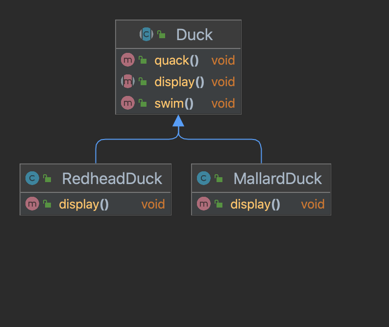
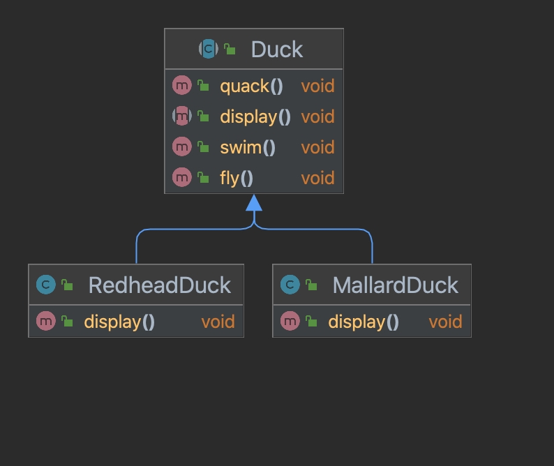
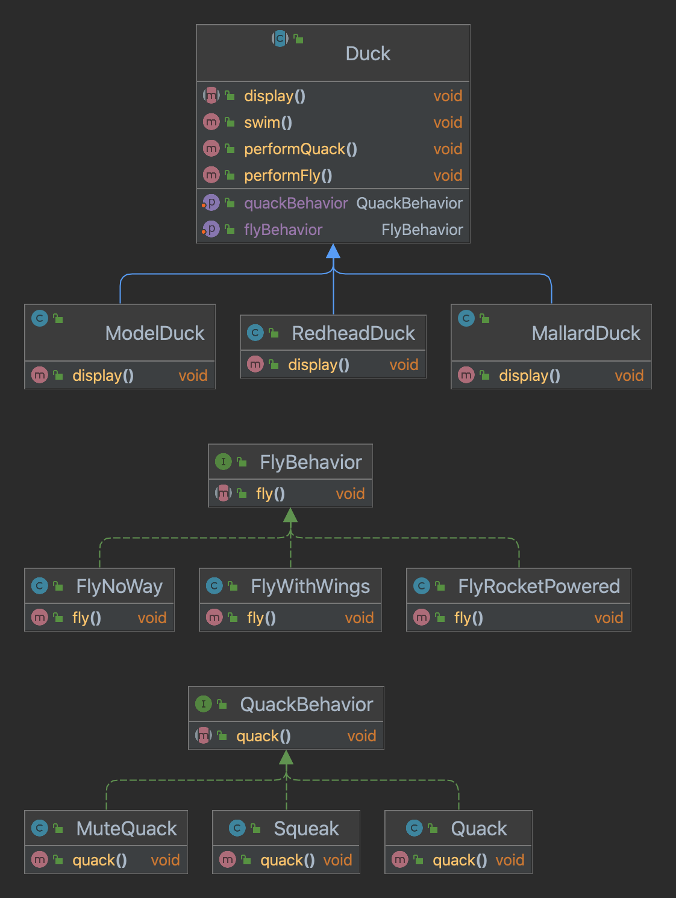

# 전략 패턴(Strategy Pattern)

## 전제조건

## [요구사항1] 소리를 낼 수 있게 해주세요.

위 다이어그램처럼 상위 클래스에 quack 이라는 함수를 추가해 하위 클래스에서 상속 받을 수 있지만 몇 가지 단점이 될 만한 요소들이 있습니다.

### 상속할 때 단점이 될 수 있는 요소
- [x] 서브클래스에서 코드가 중복된다.
- [x] 실행 시에 특징을 바꾸기 힘들다.
- [ ] 오리가 춤추게 만들 수 없다.
- [ ] 모든 오리의 행동을 알기 힘들다.
- [ ] 오리가 날면서 동시에 꽥꽥거릴 수 없다.
- [x] 코드를 변경했을 때 다른 오리들에게 원치 않은 영향을 끼칠 수 있다.

### 애플리케이션을 만드는 과정에서 코드를 바꿔야 했던 이유
- 잦은 기획 변경
- 레거시 코드
- 운영중 발생한 버그 혹은 성능 이슈

이러한 이유에 있어서 우리는 달라지는 부분을 찾아서 나머지 코드에 영향을 주지 않도록 '캡슐화'해야 합니다.

### 바뀌는 부분과 그렇지 않은 부분 분리하기
"인터페이스에 맞춰서 프로그래밍한다"라는 말은 "상위 형식에 맞춰서 프로그래밍한다"라는 말입니다.

- 오리의 행동은 오리마다 바뀔 수 있다는 생각을 합니다.
- 나는 행동, 소리내는 행동 각각을 구성하는 인터페이스를 구현합니다.
- 각기 다른 행동에 대한 클래스를 해당 인터페이스로 구현합니다.

## [요구사항2] 동적으로 행동 지정하기
서브클래스에서 세터 메소드(setter method)를 호출하는 방법으로 설정할 수 있도록 상위 클래스에 메소드를 추가합니다.

## [뇌 단련] Duck 클래스를 상속받지 않고 오리 호출기를 구현하기
분리해 놓은 소리내는 행동 인터페이스로 호출기 클래스를 구현합니다.