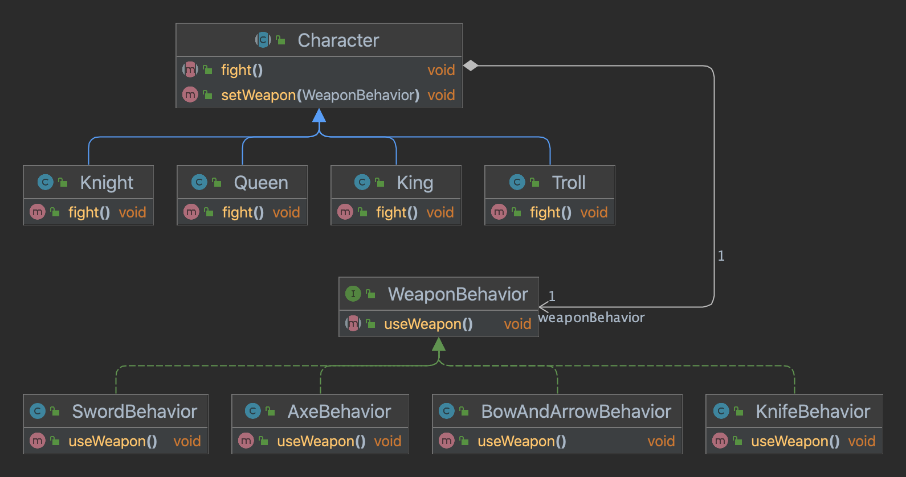

## 디자인 퍼즐

### 해야할 일
1. 클래스를 정돈합니다.
2. 추상 클래스 1개, 인터페이스 1개, 그리고 클래스 8개를 골라냅니다. 
3. 클래스들을 화살표롤 연결합니다.
    - 상속(확장)
    - 인터페이스(구현)
    - "A에는 B가 있다"
4. 적당한 클래스에 setWeapon() 함수를 추가하세요.

- Character 클래스는 모든 캐릭터()가 공유하는 추상클래스여야 합니다.
- WeaponBehavior 는 모든 무기 클래스에서 구현해야 하는 인터페이스입니다.
- 