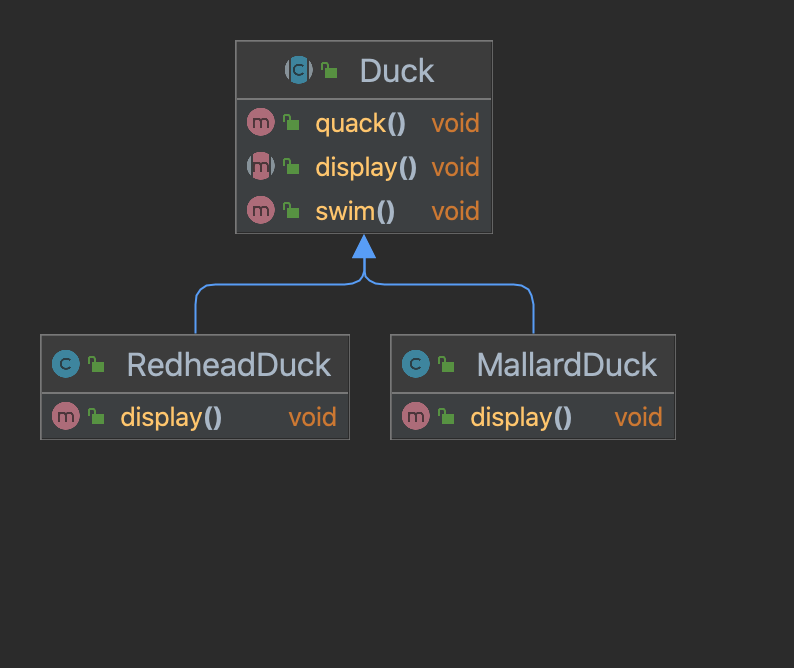
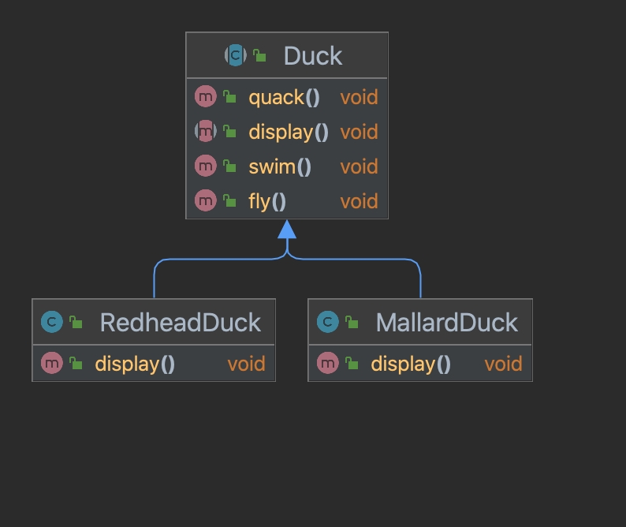
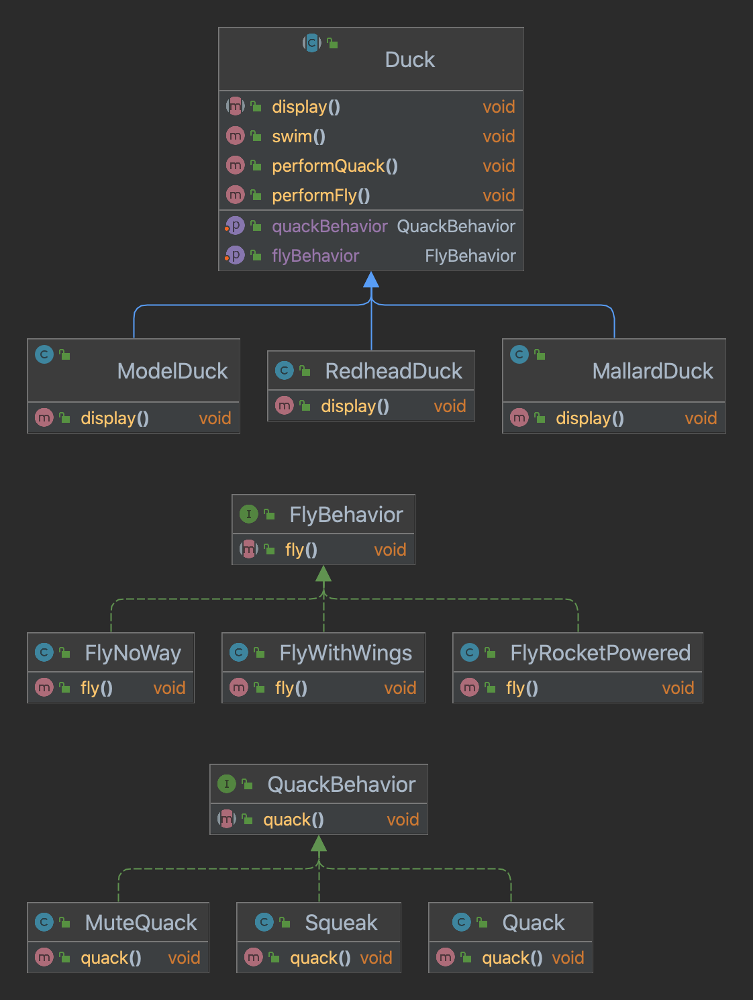

# 전략 패턴(Strategy Pattern)

## 전제조건

## [요구사항1] 소리를 낼 수 있게 해주세요.

위 다이어그램처럼 상위 클래스에 quack 이라는 함수를 추가해 하위 클래스에서 상속 받을 수 있지만 몇 가지 단점이 될 만한 요소들이 있습니다.

### 상속할 때 단점이 될 수 있는 요소
- [x] 서브클래스에서 코드가 중복된다.
- [x] 실행 시에 특징을 바꾸기 힘들다.
- [ ] 오리가 춤추게 만들 수 없다.
- [x] 모든 오리의 행동을 알기 힘들다.
- [ ] 오리가 날면서 동시에 꽥꽥거릴 수 없다.
- [x] 코드를 변경했을 때 다른 오리들에게 원치 않은 영향을 끼칠 수 있다.

### 애플리케이션을 만드는 과정에서 코드를 바꿔야 했던 이유
- 고객이나 사용자가 다른 것을 요구하거나 새로운 기능을 원할 때
- 데이터베이스 바꾸기로 했는데, 사용하는 데이터 포맷과 완전히 다른 경우 
- 기술이 발전하면서 새로운 규약을 사용하기 위해
- 레거시 코드의 변경

이러한 이유에 있어서 우리는 달라지는 부분을 찾아서 나머지 코드에 영향을 주지 않도록 '캡슐화'해야 합니다.

### 바뀌는 부분과 그렇지 않은 부분 분리하기
"인터페이스에 맞춰서 프로그래밍한다"라는 말은 "상위 형식에 맞춰서 프로그래밍한다"라는 말입니다.

- 오리의 행동은 오리마다 바뀔 수 있다는 생각을 합니다.
- 나는 행동, 소리내는 행동 각각을 구성하는 인터페이스를 구현합니다.
- 각기 다른 행동에 대한 클래스를 해당 인터페이스로 구현합니다.

## [요구사항2] 동적으로 행동 지정하기
서브클래스에서 세터 메소드(setter method)를 호출하는 방법으로 설정할 수 있도록 상위 클래스에 메소드를 추가합니다.

## [뇌 단련] Duck 클래스를 상속받지 않고 오리 호출기를 구현하기
분리해 놓은 소리내는 행동 인터페이스로 호출기 클래스를 구현합니다.

## 낱말 퀴즈
1. 패턴은 **유연한**(flexible)애플리케이션을 만드는데 도움이 됩니다.
2. 패턴을 **머리**(brain)에 넣어주세요.
3. 꽥꽥 소리를 낼 수 없는 오리는? **가짜오리**(decoyduck)
4. 전략 패턴을 쓰면 코드를 **재사용**(reused)할 수 있습니다.
5. 고무 오리는 **삑삑 소리**(squeak)를 냅니다.
6. 바뀔 수 있는 부분은 **캡슐화**(encapsulate)해야 합니다.
7. 상속보다는 **구성**(composition)이 더 낫죠.
8. 개발에 있어서 바뀌지 않는 것! **변화**(change)
9. 자바 IO, 네트워킹, 사운드 **APIs**
10. 패턴은 대부분 객체지향 **원칙**(principles)을 따릅니다.
11. 베이컨이 들어있는 구운 치즈 샌드위치를 **잭 베니**(jackbenny)라고 부릅니다.
12. 디자인 패턴은 서로 공유하는 **용어**(vocabulary)입니다.
13. 아까 오창이 **옵저버**(observer) 패턴을 좋아했죠?
14. 고수준 라이브러리를 **프레임워크**(frameworks)라고 부릅니다.
15. 다른 사람의 **경험**(experience)으로부터 배울 수 있어야 합니다.
16. SimUduck 데모를 선보였던 주주총회가 열렸던 곳의 지명은? **마우이**(maui)
17. 시뮬레이터에 있는 문제를 **전략**(strategy)패턴으로 해결했죠?
18. 구현보다는 **인터페이스**(interface)에 맞춰서 프로그래밍해야 합니다.